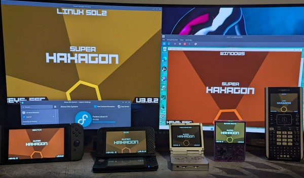
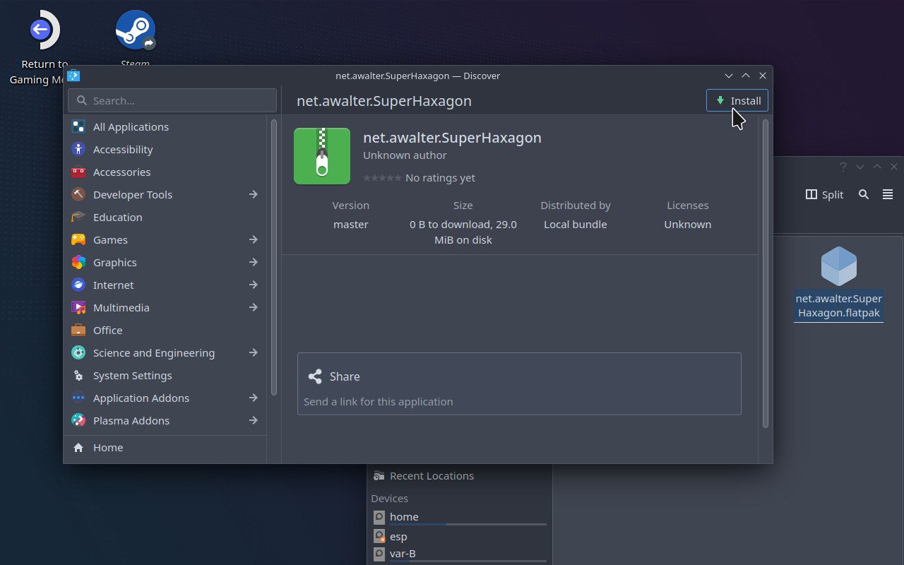
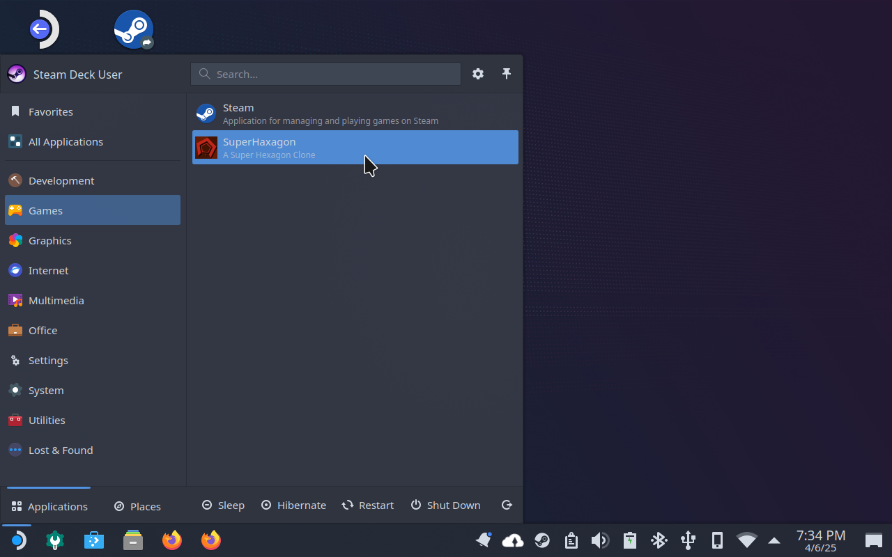
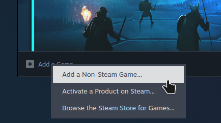
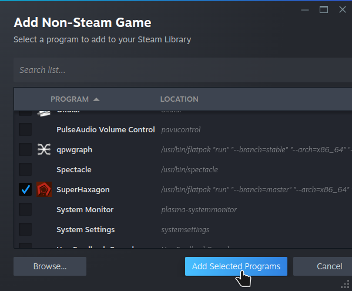

<p align="center"></p>

#  Installation

SuperHaxagon supports many different platforms and has many different ways to install. Find your platform below and 
follow the instructions to install SuperHaxagon on your device!

## Download

The first step is to download the release you need. The latest release can always be found here:

https://github.com/RedTopper/Super-Haxagon/releases

> [!IMPORTANT]  
> For any release containing `no-romfs.zip`, please ensure you _also_ download and extract the romfs folder, 
> pictured below:

Before:

```
└── SuperHaxagon
    ├── ...
    ├── PLACE_ROMFS_FOLDER_HERE.txt
    └── SuperHaxagon
```

After:

```
└── SuperHaxagon
    ├── ...
    ├── romfs
    │   ├── ...
    │   └── levels.haxagon
    └── SuperHaxagon
```

Then, click on the installation instructions you need below for your platform!

## [Nintendo 3DS](./driver/N3DS/INSTALL.md)

## [TI-Nspire (First Gen)](./driver/Nspire/INSTALL.md)

## Windows (x86_64)

<details><summary>Windows Install Instructions</summary>

_Note: SFML requires a graphics adapter with OpenGL 3.2 or higher. SuperHaxagon may be unsupported on 
first generation Intel processors, Remote Desktop sessions, or VMs with no hardware acceleration. 
See [#22](https://github.com/RedTopper/Super-Haxagon/issues/22) for details._

1. Download `SuperHaxagon-Windows-x86_64-no-romfs.zip` and `romfs.zip`
2. Extract the files into any empty directory
3. Place the `romfs` folder from `romfs.zip` next to the `.exe` file
4. Launch the game!

</details>

## Desktop Linux (x86_64/arm64)

<details><summary>Linux Install Instructions</summary>

There are 2 different native ways to install SuperHaxagon on Linux. Pick one that works best for you below!
(For Flatpak, see Steam Deck instructions in the next section)

### SFML (Static Link, x86_64/arm64)

SFML is statically linked, so you shouldn't need it installed as a dependency!

1. Download `SuperHaxagon-LinuxSFML-<arch>-no-romfs.zip` and `romfs.zip`
2. Extract the files into any empty directory
3. Extract and place the `romfs` folder from `romfs.zip` next to the `SuperHaxagon` file
4. `./SuperHaxagon`

### SDL2 (Dynamic Link, x86_64)

The SDL2 driver requires SDL2 installed on your system. Please find the appropriate command for your distro to install 
SDL2 first! SDL2 comes with native controller support.

1. Install SDL2 from your distro's package manager, if needed  
   Fedora: `sudo dnf install -y SDL2 SDL2_mixer SDL2_ttf`  
   Ubuntu: `sudo apt update && sudo apt install -y libsdl2 libsdl2-mixer libsdl2-ttf`  
2. Download `SuperHaxagon-LinuxSDL2-x86_64-no-romfs.zip` and `romfs.zip`
3. Extract the files into any empty directory
4. Extract and place the `romfs` folder from `romfs.zip` next to the `SuperHaxagon` file
5. `./SuperHaxagon`

Note: Consider using the PortMaster build for arm64 SDL2 usage.

</details>

## Steam Deck (Flatpak)

<details><summary>SteamDeck Install Instructions</summary>

### Easy Installation via Discover and Steam

1. Download and extract `net.awalter.SuperHaxagon-x86_64.zip`
2. Open the `.flatpak` file in Discover and press install:  
     
3. Test SuperHaxagon by launching the game through the Application Launcher  
     
4. Add SuperHaxagon as a Non-Steam Game  
     
     
5. Leave Desktop Mode and launch via "NON-STEAM" tab on the Library view

### Via CLI (All other platforms)

1. Download and extract `net.awalter.SuperHaxagon-x86_64.zip`
2. Run `flatpak --user install net.awalter.SuperHaxagon.flatpak`
3. Run `flatpak run net.awalter.SuperHaxagon` or find SuperHaxagon in your system's application launcher!

</details>


## Nintendo Switch

<details><summary>Switch Install Instructions</summary>

1. Download and extract `SuperHaxagon-Switch-arm64.zip`
2. Merge `switch` into your SD card, placing `SuperHaxagon.nro` in `sdmc:/switch/SuperHaxagon`
3. Launch the homebrew launcher (either in Applet mode (Album) or Game mode (R) )
4. Launch SuperHaxagon

If you want to change the title screen music, you can additionally place any .ogg file on your SD card at
`sdmc:/switch/SuperHaxagon/title.ogg`

</details>

## Miyoo Mini (OnionOS)

<details><summary>Miyoo Mini install instructions</summary>

The stock OS is not supported or tested. Please use OnionOS.

1. Download `SuperHaxagon-MiyooMini-armhf-no-romfs.zip` and `romfs.zip`
2. Extract and merge the `Roms` folder to the root of your SD card
3. Navigate to `Roms/PORTS/Games/SuperHaxagon/` and extract the `romfs` folder from `romfs.zip`
4. On the Miyoo device, navigate to Games > Ports > ~Import ports
5. Find SuperHaxagon in the Arcade folder and launch!

</details>

## PortMaster (Retro Handhelds)

<details><summary>PortMaster install instructions</summary>

The PortMaster should work on any CFW where PortMaster is supported. Please use the "autoinstall" 
folder to install the zip manually from this repo. It is "Ready to Run" and contains all assets, 
including the romfs folder.

1. Download `SuperHaxagon-PortMaster-arm64.zip`
2. Place it in your PortMaster's `autoinstall` folder
   * For muOS: `/mnt/mmc/MUOS/PortMaster/autoinstall/`
   * For Knulli: `/media/SHARE/system/.local/share/PortMaster/autoinstall/`
   * For other CFWs, see the PortMaster documentation for your platform.
3. Launch the PortMaster app and watch it install
4. Refresh your game list (varies by CFW)
5. Find SuperHaxagon (likely in Ports) and launch it!

</details>

## macOS (M or Intel)

<details><summary>macOS install instructions</summary>

Unfortunately I do not have a macOS machine regularly test SuperHaxagon with, but it should always build!

The release build is built for M1 processors (arm64). [Intel based macs will need to follow the Building instructions](./driver/SFML-macOS/README.md)

1. Download and extract `SuperHaxagon-macOS-arm64.app.tar.zip`
2. Launch the application by right-clicking and choosing "Open"

</details>

## Other platforms

<details><summary>All other platforms</summary>

It may be possible to build and run SuperHaxagon on other platforms, as it is designed to be portable. 
You can likely build it by following the instructions in the [README.md](./README.md). I'd love to hear
any success for building for other platforms!

</details>
