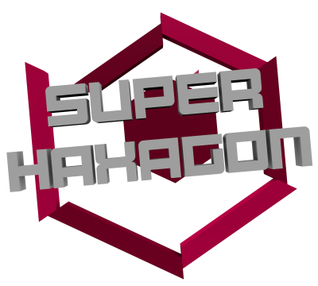
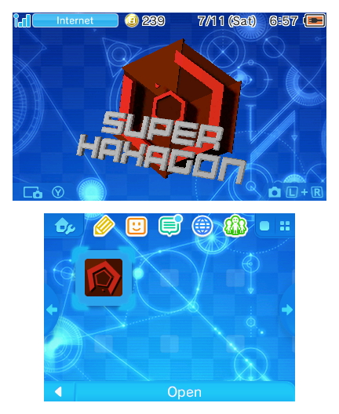
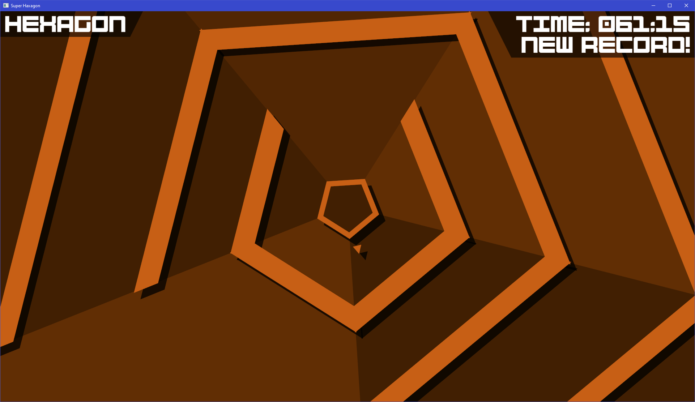
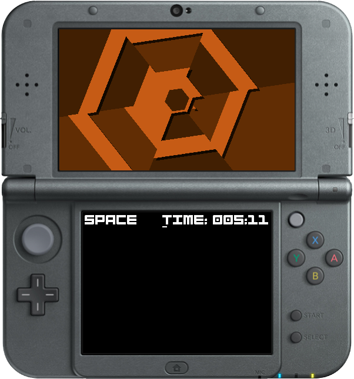
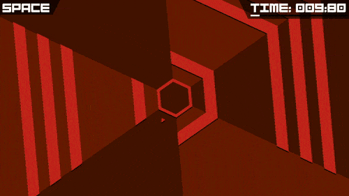
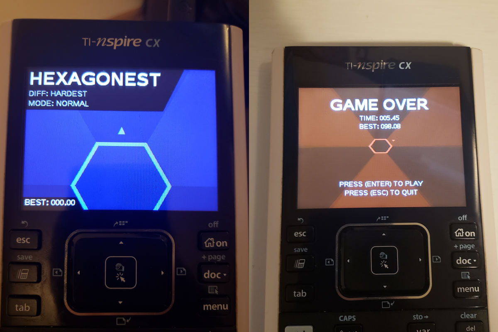
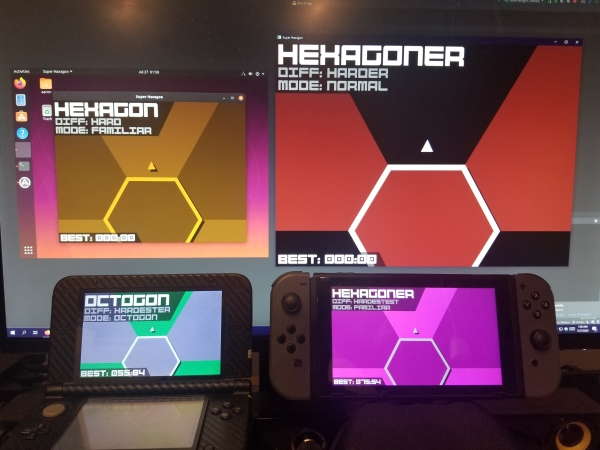
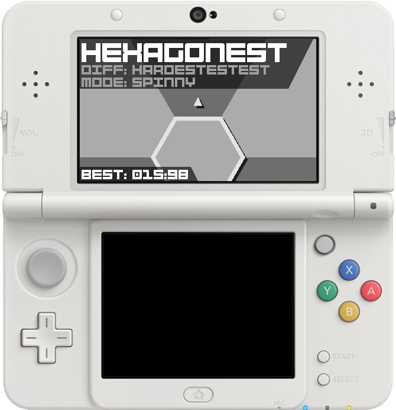
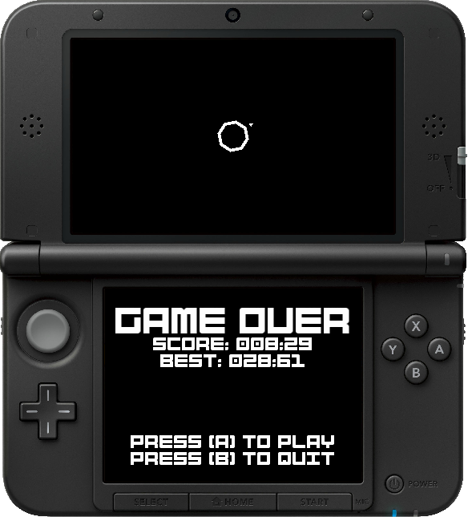

<p align="center"></p>

<!-- Note: icon-3ds.png name kept for backwards compatability with old readmes. -->

#  SuperHaxagon

[SuperHaxagon](https://github.com/RedTopper/Super-Haxagon), like the original game [Super Hexagon](http://superhexagon.com/)
by Terry Cavanagh, has only one goal. Survive as long as possible by avoiding the falling walls in a trippy, spinny frenzy!

SuperHaxagon is a cross-platform, open source _Super Hexagon_ clone for the Nintendo 3DS, Nintendo Switch, Windows,
Linux, Portmaster, Miyoo Mini, and the [TI-Nspire](https://education.ti.com/en/products/calculators/graphing-calculators/ti-nspire-cx-cas) (yes, the calculator). It is developed in C++ and uses no 
additional libraries for the core logic, making it easy (in theory) to port to new platforms. It also has a GUI based 
level editor called [Haxa Editor](https://github.com/RedTopper/Haxa-Editor).

## Features

* Cross-platform with modular drivers
* Music timed camera and spin effects
* Device independent 3D effects
* Supports any aspect ratio
* Supports high refresh rates
* Create custom levels
* Save files for scores
* Build toolchain with cmake

## Download

You can download the latest build on [the releases page](https://github.com/RedTopper/Super-Haxagon/releases) to the right.

## Install

SuperHaxagon supports many different devices. [Find your install instructions here](./INSTALL.md)!

## Building

The first step is always to clone this repository with:

```bash
git clone https://github.com/RedTopper/Super-Haxagon.git
```

Then, [find your device in the driver directory](./driver).

* [3DS](./driver/3DS/README.md) for the Nintendo 3DS
* [Example](./driver/Example/README.md) for building an example driver
* [Linux](./driver/Linux/README.md) for Linux
* [Linux-SDL2](./driver/Linux-SDL2/README.md) for Linux with the SDL2 backend
* [macOS](./driver/macOS/README.md) for macOS
* [Miyoo](./driver/Miyoo/README.md) for the MiyooMini
* [Nspire](./driver/Nspire/README.md) for the TI-Nspire
* [PortMaster](./driver/PortMaster/README.md) for PortMaster and retro gaming handhelds
* [Switch](./driver/Switch/README.md) for the Nintendo Switch
* [Windows](./driver/Switch/README.md) for Microsoft Windows

## Credits

 * The original game [Super Hexagon](http://superhexagon.com/) by Terry Cavanagh
 * The people on the [contributors page](https://github.com/RedTopper/Super-Haxagon/graphs/contributors) (seriously, you guys rock!)

### Assets

Licenses for assets provided by the following people can now be found in [the CREDITS.md file](./CREDITS.md):

 * [TwistBit](https://github.com/TwistBit)
 * [aaronamar](http://fontstruct.com/fontstructions/show/155156/bump_it_up)
 * [Kevin MacLeod](http://incompetech.com/)
 * [Dunderpatrullen](https://dunderpatrullen.nu/)
 * [Bossfight](https://www.bossfightmusic.com/)

### Libraries

Individual library credits and licenses have moved to the device driver itself.
Please check out these individual LICENSE.md files for links to the wonderful projects
that make SuperHaxagon possible!

 * [3DS Driver](./driver/3DS/LICENSE.md) for the Nintendo 3DS
 * [Switch Driver](./driver/Switch/LICENSE.md) for the Nintendo Switch
 * [Nspire Driver](./driver/Nspire/LICENSE.md) for the TI-Nspire
 * [SFML Driver](./driver/Switch/LICENSE.md) for Linux, macOS, and Windows
 * [SDL2 Driver](./driver/SDL2/LICENSE.md) for PortMaster and MiyooMini

## License

SuperHaxagon is now licensed under GPLv3 (or later) to ensure that any implementation across any platform will
remain open for as long as possible!

The individual drivers originally written by me are dual-licensed under MIT to ensure other projects that do not
want to use the GPL can continue use this code to port their projects to new platforms.

New drivers may elect to use this "dual licensing" scheme, or simply use GPLv3 if they want more copyleft protections.

This license does not apply to assets or iconography, which have various licenses listed out in 
[the CREDITS.md file](./CREDITS.md).

## Beatmaps

If you are looking to swap out the existing music tracks with your own, you may be wondering what's up with those
`.txt` files next to the tracks. These metadata files provide information to the game about when to time beats,
spins, tilts, zooms, and any other effects while the music is running.

While it _may_ be possible to automatically generate the "beats" from the music itself at runtime, some platforms
(the TI-NSpire, mostly) don't have the spare CPU cycles to deal with decoding music, so I found the best balance
to write out the events manually.

You can open these `.txt` files in [Audacity](https://www.audacityteam.org/) as a
[Label Track](https://manual.audacityteam.org/man/creating_and_selecting_labels.html). If they change, the
events that the game can recognize are found in the `Play::update()` function within `Play.cpp`, and are
currently as follows:

* **S**: A large, sudden spin
* **I**: Invert the background colors
* **BL**: Large beat, when the music is really thumping
* **BS**: Small beat
* **TL**: Tilt the level by moving the main camera to the left
* **TR**: Tilt the level by moving the main camera to the right
* **Z**: A huge, diving zoom.

_(Yes, deleting these files is cheating)_

## Cross Platform

Below are a few screenshots featuring the various platforms that SuperHaxagon compiles on. The 3DS version is packaged 
with a custom 3D banner to make it look official. Additionally, the gif was recorded on actual Nintendo Switch hardware.








<details><summary>More Screenshots</summary>






</details>

<details><summary>Proof of Concept</summary>


</details>
