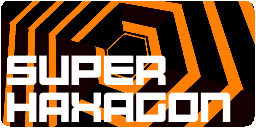
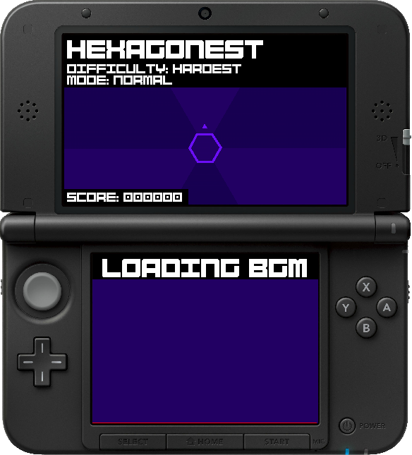
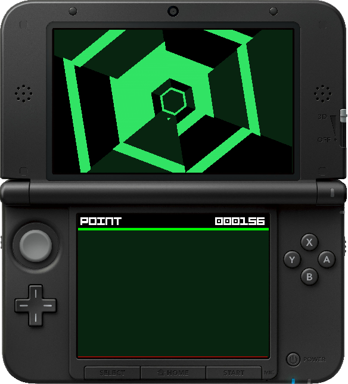
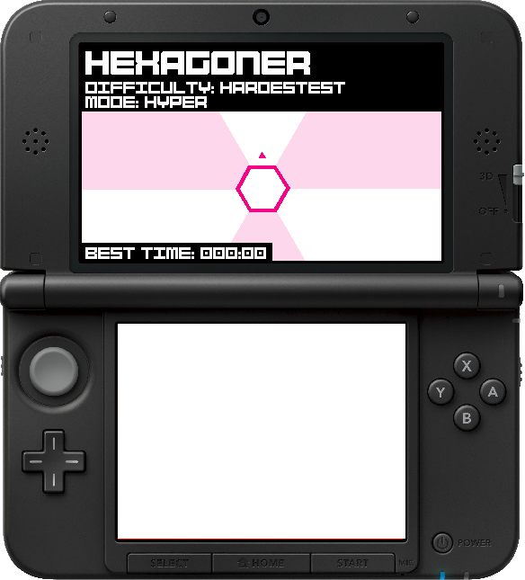

#  Super-Haxagon

This is a Super Hexagon clone for the Nintendo 3DS. This should run on both o3ds, n3ds, and ~~Citra homebrew environments~~ nevermind, it can't emulate it fast enough. The Makefile also creates a CFW compatible CIA too, for those who are into that kind of stuff. A banner is included.

### Download

None yet! This is still in development. You can either compile it for now by yourself or wait for me to make it stable enough for the masses.

Contributing to the project will help create a better game for everyone! If you would like to help, feel free to create a pull request. I know for a fact I messed up somewhere in the code here. If you are implementing a new feature, I'd be happy to acccept it! 

### Features

 * 6 selectable levels
 * Open source AND readable code
 * Sound using ndsp
 * Level Editor written in Java
 * Walls actually move to the player
 * Level patterns dynamically loaded from a .LEVE file.
 * Fonts via [flarn2006/SF2DBmpFont](https://github.com/flarn2006/SF2DBmpFont)
 * Audio from [Open Hexagon](http://vittorioromeo.info/projects.html)
 * Render from [xerpi/sf2dlib](https://github.com/xerpi/sf2dlib)

### To Improve

 * This game uses a software rendering function. This could probably be redone using the GPU but whatever.
 * Collision
 * Game over screen

### Screenshots

