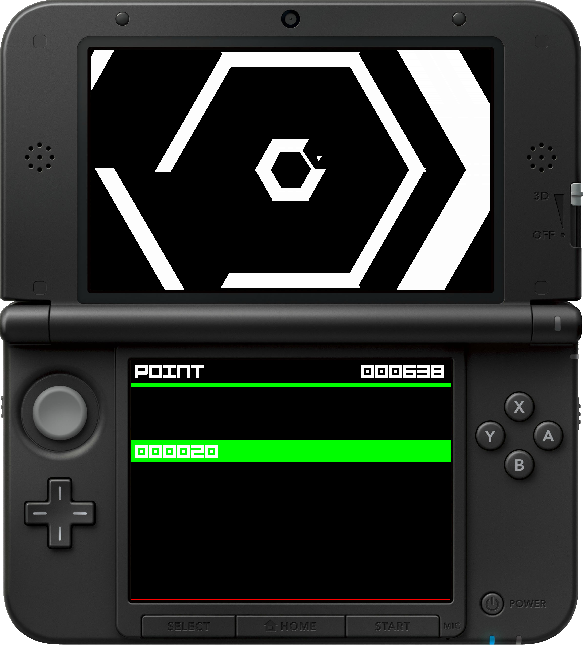

#  Super-Haxagon

This is a Super Hexagon clone for the Nintendo 3DS. This should run on the o3ds, n3ds, and Citra homebrew environments. The Makefile also creates a CFW compatible CIA too, for those who are into that kind of stuff. A banner is included.

### Download

Downloads are available from the [releases page](https://github.com/RedInquisitive/Super-Haxagon/releases).

Contributing to the project will help create a better game for everyone! If you would like to help, feel free to create a pull request. I know for a fact I messed up somewhere in the code here. If you are implementing a new feature, I'd be happy to acccept it! 

### Features

 * 6 selectable levels
 * Open source AND readable code
 * Sound using ndsp
 * Level Editor written in Java
 * Walls that move and collide with the player
 * A semi functional game over screen
 * Level patterns dynamically loaded from a .LEVE file.
 * Fonts via [flarn2006/SF2DBmpFont](https://github.com/flarn2006/SF2DBmpFont)
 * Audio from [Open Hexagon](http://vittorioromeo.info/projects.html)
 * Render from [xerpi/sf2dlib](https://github.com/xerpi/sf2dlib)

### Screenshots

