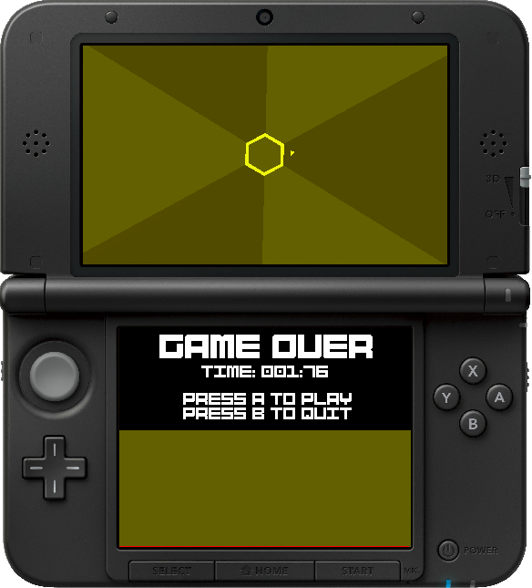

#  Super-Haxagon

This is a Super Hexagon clone for the Nintendo 3DS. This should run on the o3ds, n3ds, and Citra homebrew environments. The Makefile also creates a CFW compatible CIA too, for those who are into that kind of stuff. A banner is included.

### Download

Downloads are available from the [releases page](https://github.com/RedInquisitive/Super-Haxagon/releases).

Contributing to the project will help create a better game for everyone! If you would like to help, feel free to create a pull request. I know for a fact I messed up somewhere in the code here. If you are implementing a new feature, I'd be happy to acccept it! 

### Level Editor

Want to create your own levels to share with the community? You can use the new, completely overhuled level editor [Haxa-Editor](https://github.com/RedInquisitive/Haxa-Editor/tree/master)! Written in Java, it should work on all of your favorite platforms! (Coming Soon)

### Notes

In order for audio to work you must dump your DSP firmware. Normally, this is covered when installing A9LH through [3ds.guide](https://3ds.guide/installing-arm9loaderhax#section-vi---finalizing-setup)'s "Section VI - Finalizing setup". If it is not, Launch the Homebrew Launcher from the home menu and select “DSP Dump”.

### Features

 * Sweet 3D banner
 * 6 selectable levels
 * Open source AND readable code
 * Sound using ndsp
  * Supports uncompressed WAV files
 * Walls that move and collide with the player
  * Can collide with the player
  * You will stop moving when you hit the side of walls
 * A functional game over screen
  * Really cool death animation
  * Sound effects
 * Main menu
  * Plays sound effects and animations
 * Support by the community!
  * Audio from [Open Hexagon](http://vittorioromeo.info/projects.html)
  * Fonts via [flarn2006/SF2DBmpFont](https://github.com/flarn2006/SF2DBmpFont)
  * Render from [xerpi/sf2dlib](https://github.com/xerpi/sf2dlib)
  * And many more!

# Screenshots

